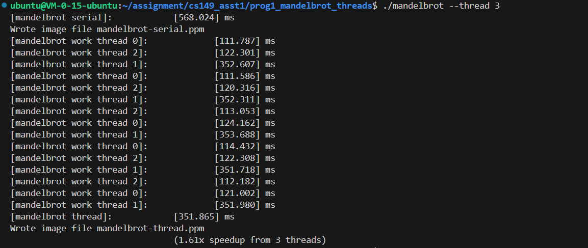
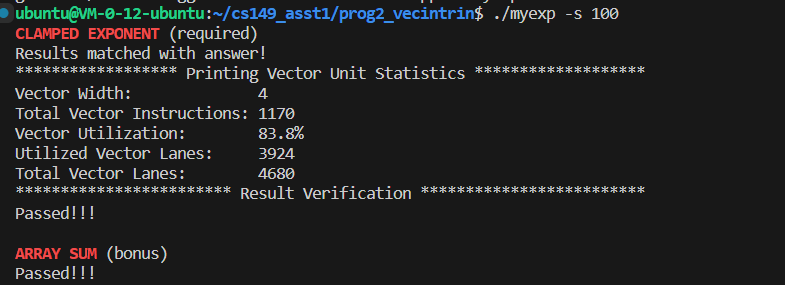
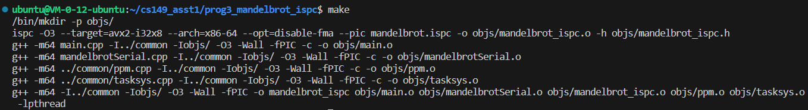
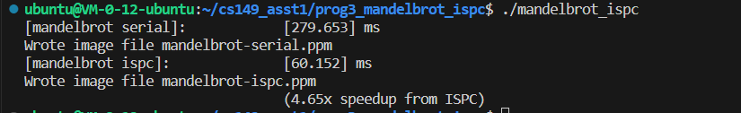
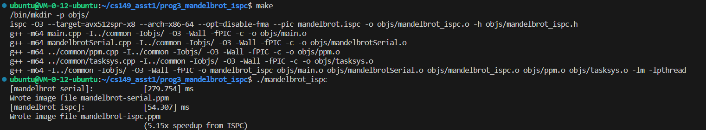
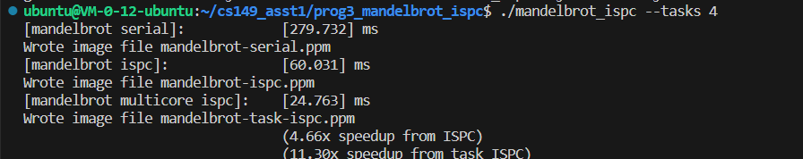
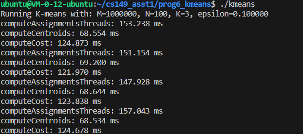
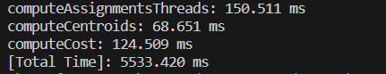

assignment website: https://github.com/stanford-cs149/asst1

## Environment Setup

使用腾讯云服务器配置
- 4核 8GB内存

1. 下载并解压ISPC
``` Shell
wget https://github.com/ispc/ispc/releases/download/v1.21.0/ispc-v1.21.0-linux.tar.gz
tar -xvf ispc-v1.21.0-linux.tar.gz
```

2. 此时ISPC解压路径为~/Downloads/ispc-v1.21.0-linux，用以下命令更新系统变量
``` Shell
export PATH=$PATH:${HOME}/Downloads/ispc-v1.21.0-linux/bin
```

3. clone相应的库
```Shell
git clone https://github.com/stanford-cs149/asst1.git
```

## Program1
该任务为将 mandelbrot set中的点转化为ppm格式的图像，串行计算的函数已经给出，要求用std::thread实现并行计算
``` C
void mandelbrotSerial(
    float x0, float y0, float x1, float y1,
    int width, int height,
    int startRow, int totalRows,
    int maxIterations,
    int output[])
{
    float dx = (x1 - x0) / width;
    float dy = (y1 - y0) / height;

    int endRow = startRow + totalRows;

    for (int j = startRow; j < endRow; j++) {
        for (int i = 0; i < width; ++i) {
            float x = x0 + i * dx;
            float y = y0 + j * dy;

            int index = (j * width + i);
            output[index] = mandel(x, y, maxIterations);
        }
    }
}
```
这里采用的是用行划分的方式，关键的decomposition代码如下
```C
    for (int i=0; i<numThreads; i++) {
        args[i].x0 = x0;
        args[i].y0 = y0;
        args[i].x1 = x1;
        args[i].y1 = y1;
        args[i].width = width;
        args[i].height = height;
        args[i].maxIterations = maxIterations;
        args[i].numThreads = numThreads;
        args[i].output = output;
      
        args[i].threadId = i;
        args[i].startRow = i * step;
        args[i].numRows = (i == numThreads - 1 ? height - i * step : step);
    }

    for (int i=1; i<numThreads; i++) {
        workers[i] = std::thread(workerThreadStart, &args[i]);
    }
    
    workerThreadStart(&args[0]);

    for (int i=1; i<numThreads; i++) {
        workers[i].join();
    }
```
下面记录不同thread数时的运行时间

|thread|time|
|-------|-------|
|1|569.859|
|2|285.803|
|3|351.865|
|4|285.099|
|5|230.840|
|6|182.307|
|7|178.109|


发现线程数从2到3，程序的运行时间不降反增。这是因为thread1的workload明显要高于thread0，2的workload：由于mandelbrot图像的特点是每个像素的亮度都和计算该像素的复杂度正相关，图像的中间远比上下两侧更亮，1号线程刚好被分配到了计算该图像的中间区域，所以计算耗时远远大于另外两个线程，也就拖慢了整体的线程运行时间。

## Program2
该任务要求用模拟的SIMD指令优化两个函数，一个是截断指数函数clampedExpSerial，另一个是求计算数组和函数arraySumSerial。

​模拟的SIMD指令在cs149intrin.h中给出了定义(向量寄存器宽度为4)。SIMD指令就是利用架构中的矢量寄存器，让一条指令能同时计算寄存器中的多个元素，达到优化目的。SIMD指令的形式和语义和汇编语言相似。 cs149intrin.h中用vector模拟了__cs149_mask类型，实现掩码的语义。例如如下对_cs149_mask_float的定义：

``` C++
template <typename T>
struct __cs149_vec {
  T value[VECTOR_WIDTH];
};

// Declare a floating point vector register with __cs149_vec_float
#define __cs149_vec_float __cs149_vec<float>
```
具体实现见代码


## Program3

### Part 1
我们在这里尝试用ISPC编译相应的mandelbrot_ispc()程序，我们可以查看相应的编译信息：

可以看到.ispc文件被编译为了.o和.h文件，其用的是AVX2指令集(使用ymm寄存器)

我们也可以修改makefile使用AVX512，看看会发生什么


### Part2
这里要求用使用ISPC_task机制，通过launch指令启动多个task，在多个核上并行运行。本实验按行从上到下平均划分task。这里给出了划分为两个tasks的例子，我们进行一下小小的修改即可。

因为是4核云服务器，所以创建4个tasks是一个不错的选择


### Program6
这里Program4和Program5我就偷懒不做了，这里对Kmeans很感兴趣来尝试一下。

该任务试图寻找K-Means算法的性能瓶颈，进行并行优化。

实验要求：
1. 只能修改KmeansThread.cpp文件
2. 只能并行化dist, computeAssignments, computeCentroids, computeCost中的一个功能函数
我们可以进行时间的测算，发现负责将点分配给聚类的computeAssignments函数是耗时最长的

观察computeAssignments函数其主要有两层循环，k遍历所有的聚类，m遍历所有的点，都每个点找到距离最近的聚类中心。由于聚类的数量并不多，可以去掉最外层循环，改用多线程的方式，每个线程负责计算所有点到一个聚类中心的距离(threadNum = K)。
``` C++
void computeAssignments(WorkerArgs *const args,double* minDist, std::mutex& mtx) {
  // Initialize arrays
  int k=args->threadId;

  // Assign datapoints to closest centroids
    for (int m = 0; m < args->M; m++) {
      double d = dist(&args->data[m * args->N],
                      &args->clusterCentroids[k * args->N], args->N);
      mtx.lock();
      if (d < minDist[m]) {
        minDist[m] = d;
        args->clusterAssignments[m] = k;
      }
      mtx.unlock();
    }
}

void computeAssignmentsThreads (WorkerArgs &args){
  std::thread workThread[maxThreads];
  WorkerArgs threadArg[maxThreads];
  double *minDist=new double[args.M];
  int step=args.M/args.numThreads;
  std::mutex mtx;

  for (int m = 0; m < args.M; m++) {
    minDist[m] = 1e30;
    args.clusterAssignments[m] = -1;
  }
  for(int i=0;i<args.K;i++){
    threadArg[i]=args;
    threadArg[i].threadId=i;
  }
  for(int i=0;i<args.K;i++){
    workThread[i]=std::thread(computeAssignments,&threadArg[i],minDist,ref(mtx));
  }
  for(int i=0;i<args.K;i++){
    workThread[i].join();
  }
  free(minDist);
  return ;
}
```
由于K个线程都要访问minDist，访问时加锁，但是由于加锁导致的频繁争锁，性能提高并不理想，所以这里采用空间换时间的方法，创建一个double myDist[K * M]，存每个点到每个聚类中心的距离,每个线程同样对应一个单独的聚类中心。即，对于线程k，其计算的点m到聚类中心k的距离存在myDist[k * m]处，这样不同的线程对应了不同的内存空间，所以不需要加锁。所有线程都计算完毕后 ，再比较出每个点最近的聚类中心。

``` C++
void computeAssignmentsThreads(WorkerArgs &args){
  std::thread workThread[maxThreads];
  WorkerArgs threadArg[maxThreads];
  double *myDist=new double[args.K*args.M];

  for(int i=0;i<args.K;i++){
    threadArg[i]=args;
    threadArg[i].threadId=i;
  }
  for(int i=0;i<args.K;i++){
    workThread[i]=std::thread(computeAssignments,&threadArg[i],myDist);
  }
  for(int i=0;i<args.K;i++){
    workThread[i].join();
  }
  for(int i=0;i<args.M;++i){
    double mymin=myDist[i];
    int k=0;
    for(int j=1;j<args.K;++j){
      if(myDist[j*i]<mymin){
        mymin=myDist[j*i];
        k=j;
      }
    }
    args.clusterAssignments[i] = k;
  }
  free(myDist);
  return ;
}
```




