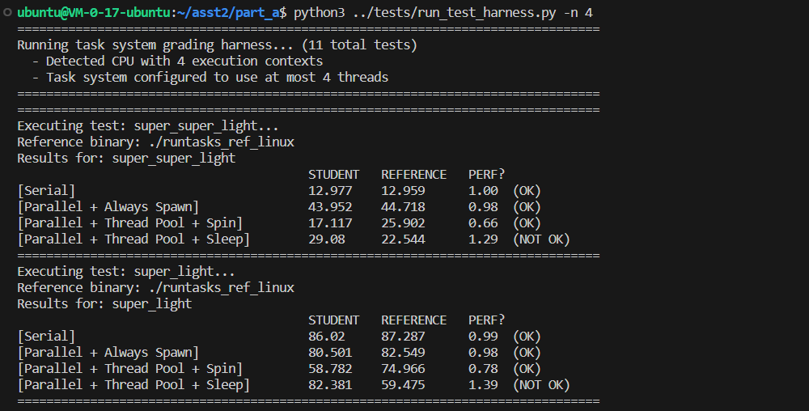

assignment website: https://github.com/stanford-cs149/asst2

In the first part of the assignment, you will implement a version of the task execution library that supports bulk (data-parallel) launch of many instances of the same task.

In the second part of the assignment, you will extend your task runtime system to execute more complex __task graphs__, where the execution of tasks may depend on the results produced by other tasks. These dependencies constrain which tasks can be safely run in parallel by your task scheduling system. Scheduling execution of data-parallel task graphs on a parallel machine is a feature of many popular parallel runtime systems ranging from the popular Thread Building Blocks library, to Apache Spark, to modern deep learning frameworks such as __PyTorch__ and __TensorFlow__.

## Part A

首先回顾C++虚函数：虚函数 是在基类中使用关键字 virtual 声明的函数。在派生类中重新定义基类中定义的虚函数时，会告诉编译器不要静态链接到该函数。当某个虚函数通过指针或者引用调用时，编译器产生的代码直到运行时才能确定到底调用哪个版本的函数。

override关键字：In a member function declaration or definition, override specifier ensures that the function is virtual and is overriding a virtual function from a base class. The program is ill-formed (a compile-time error is generated) if this is not true.

Part A要求实现一个同步的Task Execution Library，​这里默认库的使用者已经实现了自己的runnable->runTask函数，所以只需重载run函数将其改为多线程的版本，并编写一个myworker函数用于执行实际的task，其已经给出了一个线性实现的例子
``` C++
void TaskSystemSerial::run(IRunnable* runnable, int num_total_tasks) {
    for (int i = 0; i < num_total_tasks; i++) {
        runnable->runTask(i, num_total_tasks);
    }
}
```

这里需要区分fork and spawn:
- Spawn: The parent process starts a fresh process. The child process will only inherit those resources necessary to run the process objects run() method. In particular, unnecessary file descriptors and handles from the parent process will not be inherited. Starting a process using this method is rather slow compared to using fork or forkserver. [Available on Unix and Windows. The default on Windows and macOS.]
- Fork: The parent process uses os.fork() to fork the process. The child process, when it begins, is effectively identical to the parent process. All resources of the parent are inherited by the child process. Note that safely forking a multithreaded process is problematic. [Available on Unix only. The default on Unix.]

### Spawn

用线程机制简单实现TaskSpawn，将taskId定义为原子变量:
``` C++
void TaskSystemParallelSpawn::run(IRunnable* runnable, int num_total_tasks) {
    std::atomic<int> taskId(0);
	std::thread threads[this->numOfThread];

	for (auto &thread: threads) {
		thread = std::thread([&taskId, num_total_tasks, runnable] {
			for (int id = taskId++; id < num_total_tasks; id = taskId++)
				runnable->runTask(id, num_total_tasks);
		});
	}
	for (auto &thread: threads) { thread.join(); }
}
```

每次调用run() 新建和销毁线程的时候，当任务的计算成本很低时，新建和销毁线程的开销尤其明显。此时，建议使用线程池机制，其会会预先创建所有工作线程（例如在TaskSystem构造期间，或在第一次调用run()时）。

### ThreadPoolSpinning
首先在头文件中加入
```  C++
std::vector<std::thread> threads; // 表示系统中的所有线程
std::mutex queueMutex;   // 与queue组成一个互斥队列，队列元素为taskId
std::atomic<int> taskRemained{};  // 表示队列中剩余的线程个数，为0是run()结束
std::queue<int> taskQueue;
IRunnable *myRunnable{};
bool exitFlag;
int numTotalTasks{};

void func();
```

这里定义了func()来循环取出队列中的Thread执行
``` C++
void TaskSystemParallelThreadPoolSpinning::func() {
	int taskId;
	while (!exitFlag) {
		taskId = -1;
		queueMutex.lock();
		if (!taskQueue.empty()) {
			taskId = taskQueue.front();
			taskQueue.pop();
		}
		queueMutex.unlock();

		if (taskId != -1) {
			myRunnable->runTask(taskId, numTotalTasks);
			taskRemained--;
		}
	}
}
```

构造函数创建n个线程来不断的请求从线程池(互斥队列中)取出并任务执行，而析构函数不断将exitFlag置为true后就可以等待所用线程执行完成
```C++
TaskSystemParallelThreadPoolSpinning::TaskSystemParallelThreadPoolSpinning(int num_threads) : ITaskSystem(num_threads) {
	exitFlag = false;
	for (int i = 0; i < num_threads; ++i) threads.emplace_back(&TaskSystemParallelThreadPoolSpinning::func, this);
}

TaskSystemParallelThreadPoolSpinning::~TaskSystemParallelThreadPoolSpinning() {
	exitFlag = true;
	for (auto &thread: threads) { thread.join(); }
}

void TaskSystemParallelThreadPoolSpinning::run(IRunnable *runnable, int num_total_tasks) {
	myRunnable = runnable;
	taskRemained = num_total_tasks;
	numTotalTasks = num_total_tasks;
	queueMutex.lock();
	for (int i = 0; i < num_total_tasks; i++) {
		taskQueue.push(i);
	}
	queueMutex.unlock();
	while (taskRemained);
}
```

### ThreadPoolSleeping
Spinning的最大缺点就是忙等，这可能会损害性能，因为CPU资源用于运行这些线程，即使这些线程没有做有用的工作。这里需要实现线程池的睡眠机制从而避免该缺点

首先在头文件中增加：
``` C++
std::vector<std::thread> threads;
std::mutex counterLock;
std::condition_variable counterCond; // counterLock和counterCond配合task完成后唤醒主线程
std::mutex queueMutex;
std::condition_variable queueCond; // 与互斥队列配合
std::queue<int> taskQueue{};  // queueMutex和taskQueue组成互斥队列
IRunnable *myRunnable{};
int taskRemained{};
int numTotalTasks{};
bool exitFlag;
void func();
```

``` C++
void TaskSystemParallelThreadPoolSleeping::func() {
   int taskId;
   while (true) {
      while (true) {
         std::unique_lock<std::mutex> lock(queueMutex);
         queueCond.wait(lock, [] { return true; });
         if (exitFlag) return;
         if (taskQueue.empty()) continue;
         taskId = taskQueue.front();
         taskQueue.pop();
         break;
      }
      myRunnable->runTask(taskId, numTotalTasks);
      std::unique_lock<std::mutex> lock(counterLock);
      taskRemained--;
      if (taskRemained) queueCond.notify_all();
      else counterCond.notify_one();
   }
}
```
func中，线程执行一个大循环。然后进小循环，休眠等待唤醒。被唤醒后就尝试获取任务队列的锁。如果有退出标志，直接结束线程。如果队列为空，继续小循环。否则就取出队头任务，释放锁，然后开始执行任务。执行任务结束后taskRemained递减，如果还剩余任务，就唤醒工作线程，否则唤醒主线程的counterCond，检查是否可以结束run。

``` C++
TaskSystemParallelThreadPoolSleeping::TaskSystemParallelThreadPoolSleeping(int num_threads): ITaskSystem(num_threads) {
    exitFlag = false;
    for (int i = 0; i < num_threads; ++i) { threads.emplace_back(&TaskSystemParallelThreadPoolSleeping::func, this); }
}

void TaskSystemParallelThreadPoolSleeping::run(IRunnable *runnable, int num_total_tasks) {
   myRunnable = runnable;
   taskRemained = num_total_tasks;
   numTotalTasks = num_total_tasks;
   queueMutex.lock();
   for (int i = 0; i < num_total_tasks; i++) { taskQueue.push(i); }
   queueMutex.unlock();
   queueCond.notify_all();
   while (true) {
      std::unique_lock<std::mutex> lock(counterLock);
      counterCond.wait(lock, [] { return true; });
      if (!taskRemained) return;
   }
}

TaskSystemParallelThreadPoolSleeping::~TaskSystemParallelThreadPoolSleeping() {
    exitFlag = true;
    queueCond.notify_all();
    for (auto &thread: threads) { thread.join(); }
}
```
构造函数spawn num_threads个工作进程，主进程中的run函数与工作进程一起争夺QueueMutex，争夺到之后可以一次性将任务全部放入任务队列中

### Test
使用的云服务器只有4核CPU，但是原任务给的是8核最后一个test就没通过


## Part B
实现Task Execution Library的异步依赖，即构建任务图，这意味这runAsyncWithDeps()调用后立刻返回，而判断批量任务是否完成由sync()完成，当 __所有任务都完成后__ sync()才能返回：
``` C++
// assume taskA and taskB are valid instances of IRunnable...
std::vector<TaskID> noDeps;  // empty vector
ITaskSystem *t = new TaskSystem(num_threads);

// bulk launch of 4 tasks
TaskID launchA = t->runAsyncWithDeps(taskA, 4, noDeps);

// bulk launch of 8 tasks
TaskID launchB = t->runAsyncWithDeps(taskB, 8, noDeps);

// at this point tasks associated with launchA and launchB
// may still be running
t->sync();
// at this point all 12 tasks associated with launchA and launchB
// are guaranteed to have terminated
```

而通过以下的方式实现任务间的依赖关系：
``` C++
std::vector<TaskID> noDeps;  // empty vector
std::vector<TaskID> depOnA;
std::vector<TaskID> depOnBC;
ITaskSystem *t = new TaskSystem(num_threads);

TaskID launchA = t->runAsyncWithDeps(taskA, 128, noDeps);
depOnA.push_back(launchA);

TaskID launchB = t->runAsyncWithDeps(taskB, 2, depOnA);
TaskID launchC = t->runAsyncWithDeps(taskC, 6, depOnA);
depOnBC.push_back(launchB);
depOnBC.push_back(launchC);

TaskID launchD = t->runAsyncWithDeps(taskD, 32, depOnBC);
t->sync();
```

引入两个结构体。TaskGroup是每次调用runAsyncWithDeps时会创建的对象，表示一个任务组，包含编号groupId，runnable，总task数numTotalTasks，剩余task数taskRemained（原子变量），依赖任务组集合depending。同时，还重载了小于运算符，这样就能在优先队列（比拓扑排序的实现简单的多）中直接按照依赖任务组数从少到多维护。

``` C++
struct TaskGroup {
    int groupId;
    IRunnable *runnable;
    int numTotalTasks;
    std::atomic<int> taskRemained{};
    std::set<TaskID> depending;

    TaskGroup(int groupId, IRunnable *runnable, int numTotalTasks, const std::vector<TaskID> &deps) {
        this->groupId = groupId;
        this->runnable = runnable;
        this->numTotalTasks = numTotalTasks;
        this->taskRemained = numTotalTasks;
        this->depending = {};
        for (auto dep: deps) { this->depending.insert(dep); }
    }    

    friend bool operator<(const TaskGroup &a, const TaskGroup &b) {
        return a.depending.size() > b.depending.size();
    }
};

struct RunnableTask {
   TaskGroup *belongTo;
   int id;

    RunnableTask(TaskGroup *belongTo, int id) {
        this->belongTo = belongTo;
        this->id = id;
    }
};
```

只要任务组队列不为空，就循环检查队首元素是否已经不依赖任何其他任务组，如果是，就循环生成numTotalTasks个RunnableTask，互斥地放入任务队列中去执行。同样的，每放入一组任务，都唤醒等待的工作线程去获取任务。

每次有任务组完成，都会发送counterCond信号，sync()中等待此信号。收到信号后，如果所有任务组都已经完成，就返回函数。
``` C++
void TaskSystemParallelThreadPoolSleeping::sync() {
    TaskGroup *nowTaskGroup;
    RunnableTask *nowRunnableTask;
    while (!taskGroupQueue.empty()) {
        nowTaskGroup = taskGroupQueue.top();
        if (!nowTaskGroup->depending.empty()) continue;
        queueMutex.lock();
        for (int i = 0; i < nowTaskGroup->numTotalTasks; i++) {
            nowRunnableTask = new RunnableTask(nowTaskGroup, i);
            taskQueue.push(nowRunnableTask);
        }
        queueMutex.unlock();
        queueCond.notify_all();
        taskGroupQueue.pop();
    }
    while (true) {
        std::unique_lock<std::mutex> lock(counterLock);
        counterCond.wait(lock, [] { return true; });
        finishFlag = true;
        for (auto taskGroup: taskGroupSet) {
            if (taskGroup->taskRemained > 0) {
                finishFlag = false;
                break;
            }
        }
        if (finishFlag) return;
    }
}
```

取出RunnableTask对象后，还要找到所述TaskGroup对象，然后再调用runTask()。执行完成后，所属group剩余任务数递减。如果剩余任务数不大于0，则表示该任务组的所有任务已完成，循环所有TaskGroup，在depending集合中删除当前任务组。这里优先队列会自动维护，当TaskGroup中的所有任务全部完成后通知主线程检查是否全部完成。
``` C++
void TaskSystemParallelThreadPoolSleeping::func() {
    RunnableTask *task;
    TaskGroup *taskBelongTo;
    while (true) {
        while (true) {
            std::unique_lock<std::mutex> lock(queueMutex);
            queueCond.wait(lock, [] { return true; });
            if (exitFlag) return;
            if (taskQueue.empty()) continue;
            task = taskQueue.front();
            taskQueue.pop();
            break;
        }
        taskBelongTo = task->belongTo;
        taskBelongTo->runnable->runTask(task->id, taskBelongTo->numTotalTasks);
        taskBelongTo->taskRemained--;
        if (taskBelongTo->taskRemained == 0) {
            for (auto taskGroup: taskGroupSet) { 
                taskGroup->depending.erase(taskBelongTo->groupId); 
            }
            counterCond.notify_one();
        } 
        queueCond.notify_all();
    }
}
```


