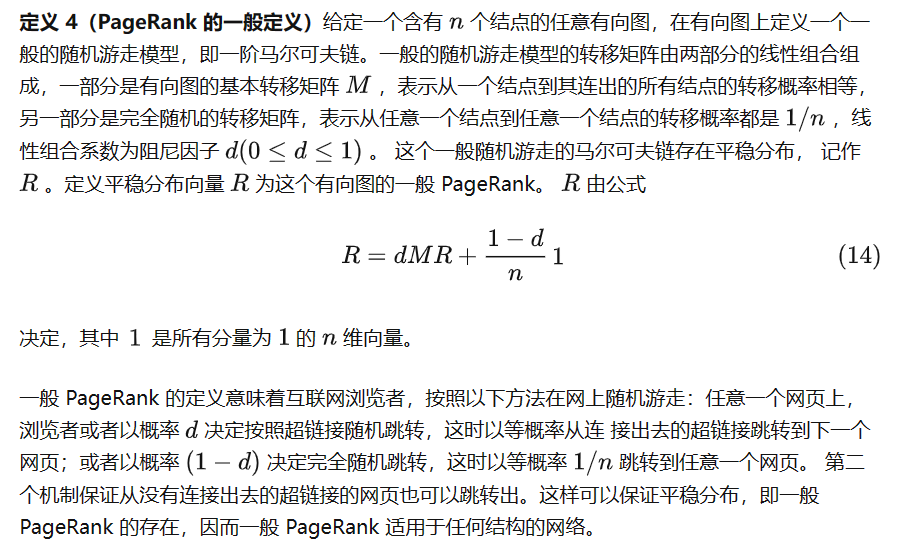
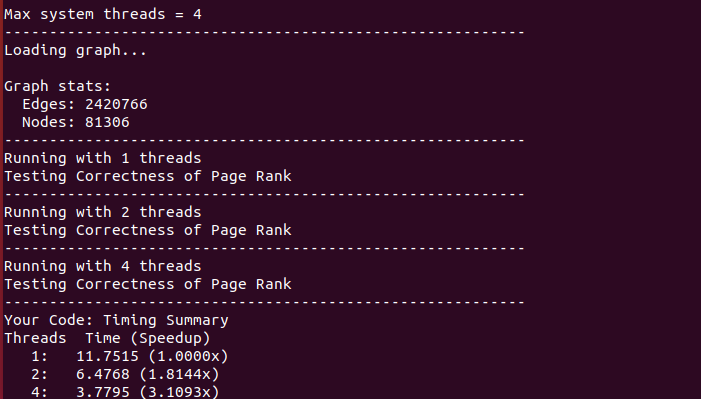

## OpenMP
下面是给出的一个简单的OpenMP的例子，其告诉了编译器，并行运行for循环，以及互斥的运行printf语句：
``` C++
/* The iterations this for loop may be parallelized */      
#pragma omp parallel for                                                      
for (int i = 0; i < 100; i++) {  

  /* different iterations of this part of the loop body may be
     run in parallel on different cores */

  #pragma omp critical                                                          
  {
    /* This block will be executed by at most one thread at a time. */
    printf("Thread %d got iteration %lu\n", omp_get_thread_num(), i);           
  }                                                                             
}
```
下面一个实现原子counter更新的例子：
``` C++
int my_counter = 0;
#pragma omp parallel for                                                        
for (int i = 0; i < 100; i++) {                                                      
    if ( ... some condition ...) {
       #pragma omp atomic
       my_counter++;
    }
}
```

这里介绍该任务最常用的两个命令：
1. __threadprivate__: 让每个线程都复制list中的变量，并唯一拥有该变量
``` C++
#pragma omp threadprivate (list) 
```
2. __declare reduction__: 给出表达式或者函数来进行规约，
``` C++
#pragma omp declare reduction ( \
reduction-identifier : typename-list : combiner) \
[initializer-clause]
```

## PageRank

在graph.h和graph_internal.h中给出了图的定义，例如outgoing_edge[outgoing_start[i]]表示以节点i为起点的边，指向的第一个节点的id，遍历所有以i为节点的边可以用以下的代码：
``` C++
for (int i=0; i<num_nodes(g); i++) {
  // Vertex is typedef'ed to an int. Vertex* points into g.outgoing_edges[]
  const Vertex* start = outgoing_begin(g, i);
  const Vertex* end = outgoing_end(g, i);
  for (const Vertex* v=start; v!=end; v++)
    printf("Edge %u %u\n", i, *v);
}
```

实现如下：
``` C++
  bool converged=false;
  Vertex* nullout=new Vertex[numNodes];
  // 计算没有出度的节点数量
  int nulloutsize=0;
  for(Vertex v=0;v<numNodes;++v){
    if(outgoing_size(g,v)==0){
      nullout[nulloutsize]=v;
      ++nulloutsize;
    }
  }
  while(!converged){
    double global_diff=0.0;
    // 展开最外部的for循环即，每个node之间逻辑并行
    // 最后将全局变量diff规约
    #pragma omp parallel for reduction(+:global_diff)
    for(Vertex vi=0;vi<numNodes;++vi){
      // 下面的代码只是将伪代码实现
      score_new[vi]=0.0;
      const Vertex* start = incoming_begin(g, vi);
      const Vertex* end = incoming_end(g, vi);
      for (const Vertex* v=start; v!=end; v++){
        score_new[vi]+=solution[*v]/outgoing_size(g,*v);
      }
      score_new[vi]=(damping*score_new[vi])+(1.0-damping)/numNodes;
      for( int i=0;i<nulloutsize;i++){
        score_new[vi]+= damping*solution[nullout[i]]/numNodes;
      }
      global_diff+=abs(score_new[vi]-solution[vi]);
    }
    converged=(global_diff<convergence);
    // void * memcpy ( void * destination, const void * source, size_t num );
    memcpy(solution,score_new,numNodes*sizeof(double));
  }
  free(nullout);
  free(score_new);
```

## TOP-DOWN BFS

这里将自顶向下的BFS改为并行算法，实现代码如下：
``` C++
    // 将最外层循环展开， 即上一层的节点之间运行并行
    int index; 
    #pragma omp parallel for
    for (int i=0; i<frontier->count; i++) {

        int node = frontier->vertices[i];

        int start_edge = g->outgoing_starts[node];
        int end_edge = (node == g->num_nodes - 1)
                           ? g->num_edges
                           : g->outgoing_starts[node + 1];

        // attempt to add all neighbors to the new frontier
        for (int neighbor=start_edge; neighbor<end_edge; neighbor++) {
            int outgoing = g->outgoing_edges[neighbor];

            if (distances[outgoing] == NOT_VISITED_MARKER) {
                distances[outgoing] = distances[node] + 1;
                // index为互斥区
                # pragma omp critical
                index = new_frontier->count++;
                new_frontier->vertices[index] = outgoing;
            }
        }
    }
```

下面给出一大佬的高性能实现，Lock-free并且性能极高：
``` C++
    // 并行运行外部的for
    #pragma omp parallel
    {
        int local_count = 0;
        int* local_frontier = (int*)malloc(sizeof(int) * (g->num_nodes));


        // 以200为一个task group的动态调度
        #pragma omp for schedule(dynamic, 200)
        for (int i=0; i<frontier->count; i++) {

            int node = frontier->vertices[i];

            int start_edge = g->outgoing_starts[node];
            int end_edge = (node == g->num_nodes - 1)
                            ? g->num_edges
                            : g->outgoing_starts[node + 1];

            // attempt to add all neighbors to the new frontier
            for (int neighbor=start_edge; neighbor<end_edge; neighbor++) {
                int outgoing = g->outgoing_edges[neighbor];

                if (distances[outgoing] == NOT_VISITED_MARKER && 
                    __sync_bool_compare_and_swap(&distances[outgoing], NOT_VISITED_MARKER, distances[node] + 1)) {
                    local_frontier[local_count++] = outgoing;
                }
           }
        }

        int start_idx = __sync_fetch_and_add(&new_frontier->count, local_count);
        memcpy(new_frontier->vertices + start_idx, local_frontier, local_count * sizeof(int));
        free(local_frontier);
    }
```

## DOWN-TOP BFS


