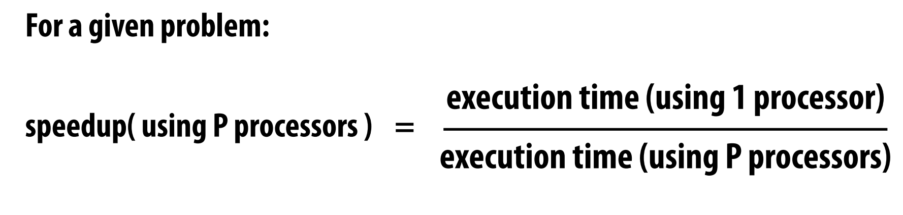
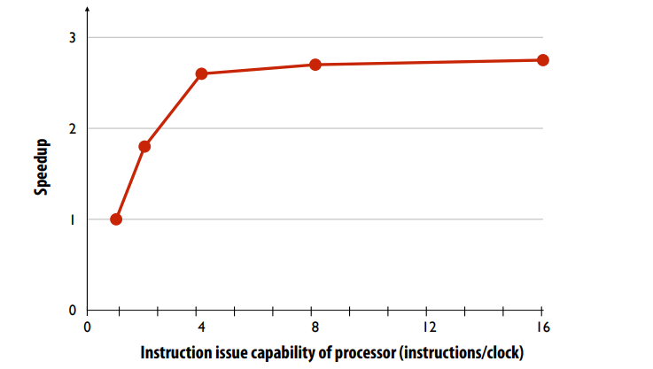
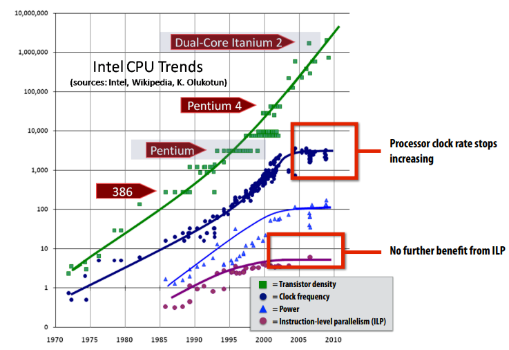

### Why parallelism?

## Basic Problem
One major motivation of using parallel processing: achieve a speedup

Why SPEEDUP can not get the level of # Processor?
1. Communication limited the maximum speedup achieved
2. Imbalance in work assignment limited speedup

## Course Theme
Parallel thinking pattern
1. Decomposing work into pieces that can safely be performed in parallel
2. Assigning work to processors 
3. Managing communication/synchronization between the processors so 
that it does not limit speedup 

Abstractions/mechanisms for performing the above tasks 
- Writing code in popular parallel programming languages

Mechanisms used to implement abstractions efficiently 
- Performance characteristics of implementations 
- Design trade-offs: performance vs. convenience vs. cost

Why do I need to know about hardware? 
- Because the characteristics of the machine really matter 
(recall speed of communication issues in earlier demos) 
- Because you care about efficiency and performance 
(you are writing parallel programs after all!)

Thinking about efficiency
- Programmer’s perspective: make use of provided machine capabilities 
- HW designer’s perspective: choosing the right capabilities to put in 
system (performance/cost, cost = silicon area?, power?, etc.)

## History of Parallelism

Until 10 years ago: two signifcant reasons 
for processor performance improvement
1. Increasing clock frequency 
2. Exploiting instruction-level parallelism (superscalar execution)

# Limit of ILP

In modern superscalar execution, processors did in fact leverage parallel execution to make 
programs run faster, it was just invisible to the programmer

Most available ILP is exploited by a processor capable of issuing four instructions per clock
(Little performance beneft from building a processing that can issue more). Because there is a limit of intrustions parallelism on the processer for general tasks.(So task and data parallelism?)

# The "Power" Wall
Power consumed by a transistor:
- Dynamic power capacitive load × voltage2 × frequency
- Static power: transistors burn power even when inactive due to leakage

High power = high heat 

Power is a critical design constraint in modern processors

# The Way to multicore
The rate of single-instruction stream 
performance scaling has decreased 
(almost to zero)

1. Frequency scaling limited by power 
2. ILP scaling tapped out 

Architects are now building faster 
processors by adding more execution 
units that run in parallel.

**Software must be written to be parallel 
to see performance gains. No more free 
lunch for software developers!**

We can get the answer of "Why Parallelism?" on the picture.

The answer 15 years ago 
- To realize performance improvements that exceeded what CPU performance 
improvements could provide 
(specifcally, in the early 2000‘s, what clock frequency scaling could provide) 
- Because if you just waited until next year, your code would run faster on the 
next generation CPU

The answer today: 
- Because it is the primary way to achieve signifcantly higher application 
performance for the foreseeable future.

