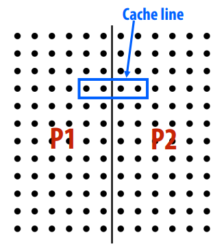
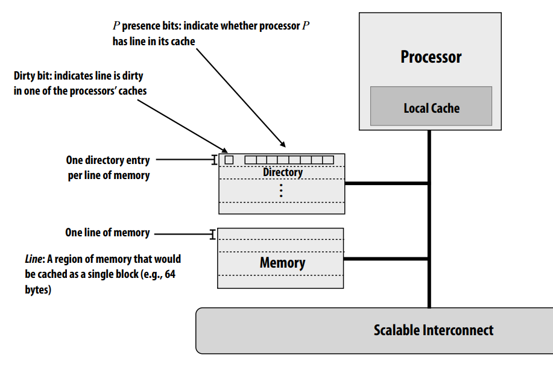
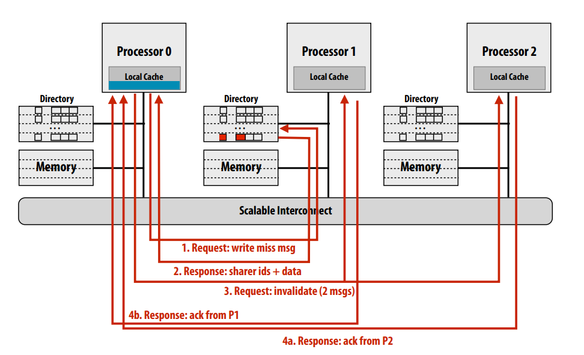
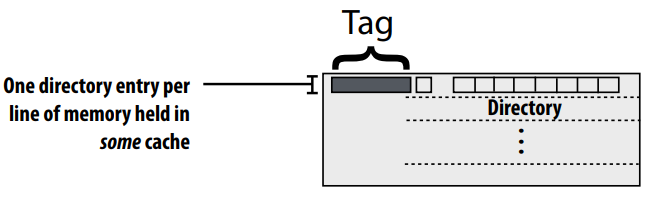

# Directory-Based Cache Coherence

## Implications of cache coherence to the programmer

We need to talk about __false sharing__:
- Condition where two processors write to different 
addresses, but addresses map to the same cache line
- Cache line “ping-pongs” between caches of writing 
processors, generating significant amounts of 
communication due to the coherence protocol
- No inherent communication, this is entirely 
artifactual communication
- False sharing can be a factor in when programming 
for cache-coherent architectures

## Direcory-Based Cache Coherence

### What limits the scalability of snooping-based approaches to cache coherence? 
The snooping cache coherence protocols relied 
on broadcasting coherence information to all processors over the 
chip interconnect. 

Every time a cache miss occurred, the triggering cache communicated with 
all other caches!So __No broadcasting! Just point-to-point!__

### Why directory-based?
Recall NUMA shared memory systems:

Idea: locating regions of memory near the processors increases scalability: it yields higher aggregate bandwidth and reduced latency (especially when there is locality in the application) But... efficiency of NUMA system does little good if the coherence protocol can’t also be scaled! 

Here is some importance terminology: 
- cc-NUMA = “cache-coherent, non-uniform memory access”(implementaion later)
- Distributed shared memory system (DSM): cache coherent, shared address space, but 
architecture implemented by physically distributed memories(discussed in future lecture)

### Directory-based cc-NUMA

"#" P bits = "#" Processors

Here is a write miss example:
1. Request memory of P1 by P0: line is clean, but resident in P1’s and P2’s caches
2. Response from P1 to P0 with sharer ids(1 and 2) and data
3. Request by P0 to invalidate the cache resident in P1 and P2(2 msgs)
4. Only when P0 get the ack from both P1 and P2, it can write this line

##  Reduce storage overhead of the directory structure
We can first try to evaluate the overhead of full bit vector directory representation:
(one presence bit per node)

Storage proportional to P x M 
- P = number of nodes (or processors)
- M = number of lines in memory 

Storage overhead rises with P 
- Assume 64 byte cache line size (512 bits) 
- 64 nodes (P=64) →12% overhead 
- 256 nodes (P=256) → 50% overhead 
- 1024 nodes (P=1024) → 200% overhead

How to reduce storage overhead of directory? Optimizations on full-bit vector scheme:
- Increase cache line size (reduce M term), but lead to more false sharing  
- Group multiple processors into a single directory “node” (reduce P term).This need only one directory bit per node, not one bit per processor 
- Hierarchical: could use snooping protocol to maintain coherence among 
processors in a node, directory across nodes

We will now discuss two alternative schemes 
- Limited pointer schemes (reduce P) 
- Sparse directories

### Limited pointer schemes
Since data is expected to only be in a few caches at once, storage for a limited number 
of pointers per directory entry should be sufficient (only a list of the nodes can
hold a valid copy of the line!)

Managing overflow in limited pointer schemes:
- Fallback to broadcast (if broadcast mechanism exists). When more than max number of sharers, revert to broadcast 
- If no broadcast mechanism present on machine, do not allow more than a max number of sharers 
- On overfow, newest sharer replaces an existing one (must invalidate line in the old sharer’s cache) 
- Coarse vector fallback. Revert to bit vector representation representation 

### Sparse directories
Key observation: the majority of memory is __NOT__ resident in 
cache. And to carry out coherence protocol the system only 
needs sharing information for lines that are currently in 
some cache 

