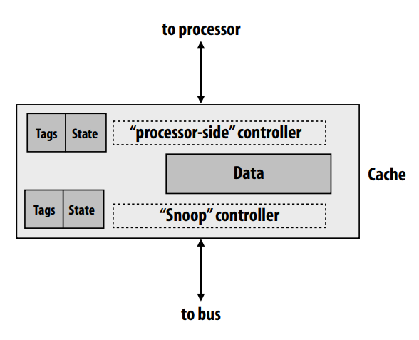

# A Basic Snooping-Based Multi-Processor Implementation

## Inclusion property of caches

All lines in closer [to processor] cache are also in farther [from processor] cache 
- e.g. contents of L1 are a subset of contents of L2 
- Thus, all transactions relevant to L1 are also relevant to L2, so it is sufficient 
for only the L2 to snoop the interconnect

If line is in owned state (M in MSI/MESI) in L1, it must also be in owned state in L2 
- Allows L2 to determine if a bus transaction is requesting a modifed cache line 
in L1 without requiring information from L1

Is inclusion maintained automatically if L2 is larger than L1? __NO!__(e.g. LRU replacement policy)

## Some Concepts
__Deadlock__ is a state where a system has outstanding operations to complete, but 
__no operation__ can make progress.

Required conditions for deadlock
1. Mutual exclusion: one processor can hold a given resource at once 
2. Hold and wait: processor must hold the resource while waiting for other 
resources needed to complete an operation 
3. No preemption: processors don’t give up resources until operation they 
wish to perform is complete 
4. Circular wait: waiting processors have mutual dependencies (a cycle exists 
in the resource dependency graph)

Livelock is a state where a system is executing many operations, but no 
thread is making __meaningful progress__.

Stavation is state where a system is making overall progress, but __some processes__ make no progress.

## Part 1: A basic implementation of snooping
We assume an atomic bus, consider a basic system design 
- One outstanding memory request per processor 
- Single level, write-back cache per processor 
- Cache can stall processor as it is carrying out coherence operations
- System interconnect is an atomic shared bus (one cache communicates at a time)

So What does atomic bus mean in a multi-processor scenario? 
- BusRd, BusRdX: no other bus transactions allowed between issuing 
address and receiving data 
- Flush: address and data sent simultaneously, received by memory 
before any other transaction allowed

Challenge: both requests from processor and bus require __tag lookup__, this may cause contention!
- Option 1: cache duplicate tags
- Option 2: multi-ported tag memory

Here is a bus in implementation:

Snoop-pending 'OR' result means only when having received all processors respond can do the next operation.

Memory controller could immediately start accessing DRAM, but not respond  if a snoop result from another cache indicates it has copy of most recent data 
Because cache should provide data, not memory.Memory could assume one of the caches will service request until snoop results are valid.

The orange means hardware components handle snooping related tasks and 
the green hardware components handle processor-related requests.

What if a request for the address of the data in the write-back buffer 
appears on the bus? Snoop controller must check the 
write-back buffer addresses in addition to cache tags. 
If there is a write-back buffer match: 
1. Respond with data from write-back buffer rather than cache 
2. Cancel outstanding bus access request (for the write back)

## Part 2:Building the system around non-atomic bus transactions
Atomic bus problem: bus is idle while response is pending(this decreases effective bus bandwidth)

Split-transaction bus: bus transactions are split into two transactions __The request__ and __The response__

Here is a basic design:
- Up to eight outstanding requests at a time (system wide) 
- Responses need not occur in the same order as requests 
- But request order establishes the total order for the system 
- Flow control via negative acknowledgements (NACKs) 
- When a buffer is full, client can NACK a transaction, causing a retry

We can have Pipelined transactions:

We also need to deal with two problem:

Conficting requests 
- Avoid conficting requests by disallowing them 
- Each cache has a copy of the request table 
- Simple policy: caches do not make requests that confict with requests 
in the request table

- -  Situation 1: P1 read miss to X, read transaction involving X is outstanding on bus
- - If outstanding request is a read: there is no confict. No need to make a new bus request, 
just listen for the response to the outstanding one
- - Situation 2: P1 read miss to X, write transaction 
involving X is outstanding on bus
- - If there is a conficting outstanding request (as determined by checking the request 
table), cache must hold request until confict clears

Flow control: 
- Caches/memory have buffers for receiving data off the bus 
- If the buffer fills, client NACKs relevant requests or responses 
(NACK = negative acknowledgement) 
- Triggers a later retry
- - Answer: use queues to accommodate variable (unpredictable) rates of production and consumption

## Let's Check
volatile int x = 10; // write to memory

What will happen?
1. Virtual address to physical address conversion (TLB lookup) 
2. TLB miss 
3. TLB update (might involve OS) 
4. OS may need to swap in page to get the appropriate page table (load from disk to physical address) 
5. Cache lookup (tag check)
6. Determine line not in cache (need to generate BusRdX) 
7. Arbitrate for bus 
8. Win bus, place address, command on bus
9. All caches perform snoop (e.g., invalidate their local copies of the relevant line)
10. Another cache or memory decides it must respond (let’s assume it’s memory) 
11. Memory request sent to memory controller 
12. Memory controller is itself a scheduler 
13. Memory controller checks active row in DRAM row buffer. (May need to activate new DRAM row. Let’s assume it does.)
14. DRAM reads values into row buffer 
15. Memory arbitrates for data bus 
16. Memory wins bus 
17. Memory puts data on bus 
18. Requesting cache grabs data, updates cache line and tags, moves line into exclusive state 
19. Processor is notifed data exists 
20. Instruction proceeds

