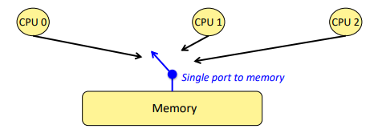
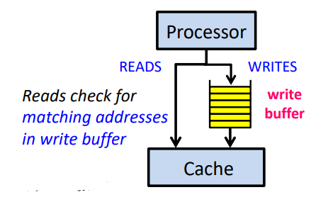
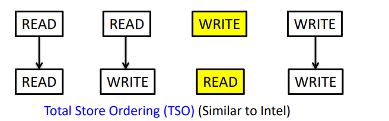
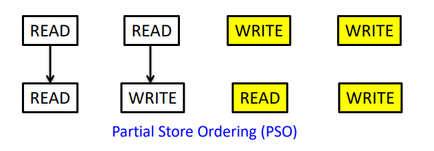

# Memory Consistency

## What is memory consistence?
What is correct behavior for a parallel memory hierarchy?Intuitive answer:
- reading a location should return the latest value written (by any thread)

We also need to compare 
1. “Cache Coherence”: do all loads and stores to a __given cache block__ behave correctly?
2. “Memory Consistency Model” (sometimes called “Memory Ordering”): do all loads and stores, even to __separate cache blocks__ behave correctly?

Our intuition(sequential consistency):

In reality:
- if the processor actually operated this way, it would be painfully slow
- instead, the processor aggressively reorders instructions to hide memory latency
Upshot:
- within a given thread, the processor preserves the program order illusion
- but this illusion has nothing to do with what happens in physical time!
- from the perspective of other threads, all bets are off!

## What happens on the uniprocessor?
Hiding memory latency is important for performance, so the idea is overlapping memory accesses with other accesses and computation(using write buffer)

Memory model specifies ordering constraints among accesses
1. Uniprocessor model: memory accesses atomic and in program order
2. Not necessary to maintain sequential order for correctness
- -  hardware: buffering, pipelining
- -  compiler: register allocation, code motion
3. Simple for programmers

## Sequential Consistency(SC)
SC is:
- accesses of each processor in program order
- all accesses appear in sequential order
- Any order implicitly assumed by programmer is maintained

One Approach to Implementing Sequential Consistency
1. Implement cache coherence: writes to the same location are observed in same order by all processors
2. For each processor, delay start of memory access until previous one completes: each processor has only one outstanding memory access at a time(Processor issues accesses one-at-a-time and stalls for completion)

When Do Memory Accesses Complete?
- Memory Reads: a read completes when its return value is bound
- Memory Writes: a write completes when the new value is “visible” to other processors

Important terminology: __visible__
- it does NOT mean that other processors have necessarily seen the value yet
- it means the new value is committed to the hypothetical serializable order (HSO),aka: a later read of X in the HSO will see either this value or a later one

## Weaker Memory Model

Using write buffer(FIFO) just to implementation the TSO model, e.g. P1 can read to address Y not having to wait P2 finish writing to address X

PSO also need a write buffer(not have to FIFO) to ensure __correctness__

“Correctness” means same results as sequential consistency, and most programs don’t require strict ordering (all of the time) for “correctness”.

## How to Synchronization?
Example: Intel __MFENCE__

An MFENCE operation enforces the ordering seen on the following picture:
- does not begin until all prior reads & writes from that thread have completed
- no subsequent read or write from that thread can start until after it finishes

MFENCE operation does NOT push values out to other threads
- it is not a magic “make every thread up-to-date” operation
- it simply stalls the thread that performs the MFENCE until write buffer empty

In addition to MFENCE, Intel also supports two other fence operations:
- LFENCE: serializes only with respect to load operations (not stores!)
- SFENCE: serializes only with respect to store operations (not loads!)

In practice, you are most likely to use:
- MFENCE
- xchg

