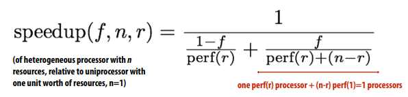

# Heterogeneous Parallelism

## Challenges of heterogeneity
Challenge for hardware designer: what is the right mixture of resources?
- Too few throughput oriented resources (lower peak throughput for parallel workloads)
- Too few sequential processing resources (limited by sequential part of workload)
- How much chip area should be dedicated to a specific function, like video? (these resources are taken away from general-purpose processing)
- Work balance must be anticipated at chip design time
- System cannot adapt to changes in usage over time, new algorithms, etc

Challenge to software developer: how to map programs onto a heterogeneous 
collection of resources?
- Challenge: “Pick the right tool for the job”: design algorithms that decompose well into components that each map well to different processing components of the machine
- The scheduling problem is more complex on a heterogeneous system 
- Available mixture of resources can dictate choice of algorithm
- Software portability & maintenance nightmare(oh gosh!)

Three trends in energy-optimized computing:

Compute less!
- Computing costs energy: parallel algorithms that do more work than sequential counterparts may not be desirable even if they run faster 

Specialize compute units:
- Heterogeneous processors: CPU-like cores + throughput-optimized cores (GPU-like cores)
- Fixed-function units: audio processing, “movement sensor processing” video decode/encode, image processing/computer vision?
- Specialized instructions: expanding set of AVX vector instructions, new instructions for accelerating AES encryption (AES-NI)
- Programmable soft logic: FPGAs

Reduce bandwidth requirements
- Exploit locality (restructure algorithms to reuse on-chip data as much as possible)
- Aggressive use of compression: perform extra computation to compress application data before transferring to memory (likely to see fixed-function HW to reduce overhead of general data 
compression/decompression)

Heterogeneous parallel processing: use a mixture of computing resources that each 
fit with mixture of needs of target applications
- Latency-optimized sequential cores, throughput-optimized parallel cores, domain-specialized fixed-function processors
- Examples exist throughout modern computing: mobile processors, servers, supercomputers

## A Example
Here is an example of heterogeneous parallelism:

We can revisit Amdahl’s law:

- f = fraction of program that is parallelizable
- n = parallel processors
- Assumptions:
Parallelizable work distributes perfectly onto n processors of equal capability

In heterogeneous computing, it become:

- f = fraction of program that is parallelizable
- n = total processing resources (e.g., transistors on a chip)
- r = resources dedicated to each processing core,
each of the n/r cores has sequential performance perf(r)

The example above can be modeled like:
- Two examples where n=16, rA = 4, rB = 1
- Assumption: perf(r) is modeled as root number r
- perf(rA) = 2, perf(rB) = 1

We can see some experiment result below(perf(r) is modele as root number r):

- X-axis = __r__ (chip with many small cores to left, fewer “fatter” cores to right)
- Each line corresponds to a different workload
- Each graph plots performance as resource allocation changes, but total chip 
resources resources kept the same (constant __n__ per graph)

So how about asymmetric set of processing cores:

- Example: n=16
One core: r = 4
Other 12 cores: r = 1
- Assumption: we only have one "fatter" core

- We can find that the speedup decay rate is much slower than tha symmetric case

