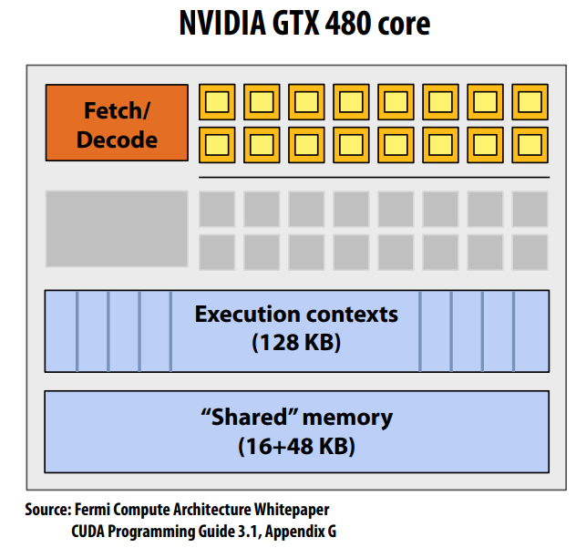

# Modern Multicore Processor

## Express the Parallelism
Try the following example of Sin(x):

```
void sinx(int N, int terms,	float* x, float* result)	
{	
	for	(int i=0; i<N; i++)	
	{	
		float value	= x[i];	
		float numer	= x[i]*	x[i]* x[i];	
		int	denom =	6; //	3!	
		int	sign = -1;	
		for(int	j=1; j<=terms; j++)	
		{		
			value += sign* numer/ denom	
			numer *= x[i]* x[i];	
			denom *= (2*j+2) * (2*j+3);	
			sign *= -1;	
		}	
		result[i] =	value;	
	}	
}
```

### Task-Parallelism
Idea #1: 
Use increasing transistor count to add more 
cores to the processor

The following code using pthreads to express the task parallelism or thread parallism.
```
typedef	struct	{	
	int	N;	
	int	terms;	
	float*	x;	
	float*	result;	
}my_args;	
void parallel_sinx(int N, int terms, float* x, float* result)	
{	
	pthread_t thread_id;	
	my_args	args;	
	args.N	= N/2;	
	args.terms = terms;	
	args.x	= x;	
	args.result	= result;	
	pthread_create(&thread_id,	NULL, my_thread_start,	&args);	//	launch	thread			
	sinx(N	- args.N, terms, x	+ args.N, result + args.N);	//	do	work	
	pthread_join(thread_id,	NULL);
}	
void my_thread_start(void* thread_arg)	
{	
	my_args* thread_args = (my_args*)thread_arg;	
	sinx(args->N, args->terms, args->x,	args->result);// do	work	
}
```

### Data-Parallism
Idea #2: 
Amortize cost/complexity of managing an 
instruction stream across many ALUs

This is just SIMD processing (Single instruction, multiple data).Same instruction broadcast to all ALUs 
Executed in parallel on all ALUs

We can use AVX to express the data-parallism.
```
#include <immintrin.h>
void sinx(int N, int terms,	float* x, float* result)	
{
	float three_fact = 6;		//	3!
	for	(int i=0; i<N; i+=8)	
	{	
		__m256	origx =	_mm256_load_ps(&x[i]);	
		__m256	value =	origx;	
		__m256	numer =	_mm256_mul_ps(origx, _mm256_mul_ps(origx, origx));	
		__m256	denom = _mm256_broadcast_ss(&three_fact);	
		int	sign =	-1;	
		for(int j=1; j<=terms;	j++)	
		{		
			//	value += sign *	numer /	denom
			__m256	tmp	=	_mm256_div_ps(_mm256_mul_ps(_mm256_set1ps(sign),numer),	denom);	
		    value =	_mm256_add_ps(value, tmp);	
			numer =	_mm256_mul_ps(numer, _mm256_mul_ps(origx, origx));	
			denom =	_mm256_mul_ps(denom, _mm256_broadcast_ss((2*j+2)*(2*j+3)));	
			sign *=	-1;	
		}	
			_mm256_store_ps(&result[i],	value);	
		}	
}
```
https://www.intel.com/content/www/us/en/docs/intrinsics-guide/index.html

So the SIMD must  follow the instruction stream coherence (“coherent execution”) 
- Same instruction sequence applies to all elements operated upon simultaneously 
- Coherent execution is necessary for efficient use of SIMD processing resources 
- Coherent execution IS NOT necessary for efficient parallelization across cores, 
since each core has the capability to fetch/decode a different instruction stream 

### SIMD execution on GPU and CPU
"Explicit SIMD" on CPU
- Instructions are generated by the compiler 
- Parallelism explicitly requested by programmer using intrinsics 
- Parallelism conveyed using parallel language semantics (e.g., forall example) 
- Parallelism inferred by dependency analysis of loops (hard problem, even best 
compilers are not great on arbitrary C/C++ code)

“Implicit SIMD” on GPU
- Compiler generates a scalar binary (scalar instructions)
- But N instances of the program are *always run* together on the processor 
```
execute(my_function,	N)		//	execute	my_function	N	times
```
- In other words, the interface to the hardware itself is data-parallel 
- Hardware (not compiler) is responsible for simultaneously executing the same 
instruction from multiple instances on different data on SIMD ALUs

## Accessing Memory
The main problem of memory:
1. Memory latency 
- The amount of time for a memory request (e.g., load, store) from a 
processor to be serviced by the memory system 
- Accessing memory is a major source of stalls
- Example: 100 cycles, 100 nsec 
2. Memory bandwidth 
- In modern computing system, DRAM always can not match the excution speed
- The rate at which the memory system can provide data to a processor 
- Example: 20 GB/s

The way to cope with memory accessing stalls
### Caches reduce length of stalls (reduce latency)

Following picture from CSAPP shows the performance of
modern cache system


### Prefetching reduces stalls (hides latency) 
All modern CPUs have logic for prefetching data into caches.Dynamically analyze program’s access patterns, predict what it will access soon.It reduces stalls since data is resident in cache when accessed
### Multi-threading reduces stalls.(hides latency)
Idea: interleave processing of multiple threads on the same core to hide stalls .Like prefetching, multi-threading is a latency hiding, not a 
latency reducing technique.

Following pictures show the trade-off between latency and throughout in hyperthreading design


Core manages execution contexts for multiple threads 
- Runs instructions from runnable threads (processor makes decision about which 
thread to run each clock, not the operating system) 
- Core still has the same number of ALU resources: multi-threading only helps use them more efficiently in the face of high-latency operations like memory access
Interleaved multi-threading (a.k.a. temporal multi-threading) 
- What I described on the previous slides: each clock, the core chooses a thread, and runs an instruction from the thread on the ALUs 
Simultaneous multi-threading (SMT) 
- Each clock, core chooses instructions from multiple threads to run on ALUs 
- Extension of superscalar CPU design 
- Example: Intel Hyper-threading (2 threads per core)

## Different Computing Unit

### A fictitious multi-core chip
- 16 cores 
- 8 SIMD ALUs per core (128 total) 
- 4 threads per core 
- 16 simultaneous instruction streams 
- 64 total concurrent instruction streams 
- 512 independent pieces of work are needed to run chip with maximal latency hiding ability


### GPUs: Extreme throughput-oriented processors
Analyze the NVIDIA GTX 480 core
- Instructions operate on 32 pieces of 
data at a time (called “warps”).(warp = thread issuing 32-wide vector instructions )
- Up to 48 warps are simultaneously interleaved
- Over 1500 elements can be processed concurrently by a core
- Why is a warp 32 elements and there 
are only 16 SIMD ALUs? (It’s a bit complicated: ALUs run at twice the clock rate of rest of chip. So each 
decoded instruction runs on 32 pieces of 
data on the 16 ALUs over two ALU clocks. )


### CPU vs GPU


Task: element-wise multiplication of two vectors A and B 
Assume vectors contain millions of elements 
- Load input A[i] 
- Load input B[i] 
- Compute A[i] × B[i] 
- Store result into C[i]

~ 3% efficiency… but 7x faster than quad-core CPU! 
(2.6 GHz Core i7 Gen 4 quad-core CPU connected to 25 GB/sec memory bus will exhibit similar efficiency on this computation)
 
**Just recall the roofline model!**

Due to high arithmetic capability on modern chips, many parallel 
applications (on both CPUs and GPUs) are bandwidth bound 

Performant parallel programs will: 

Organize computation to fetch data from memory less often 
- Reuse data previously loaded by the same thread
(traditional intra-thread temporal locality optimizations) 
- Share data across threads (inter-thread cooperation) 

Request data less often (instead, do more arithmetic: it’s “free”) 
- Useful term: “arithmetic intensity” — ratio of math operations to data 
access operations in an instruction stream
- Main point: programs must have high arithmetic intensity to utilize 
modern processors efficiently