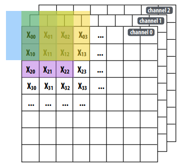
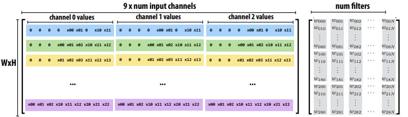
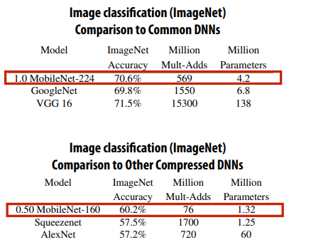
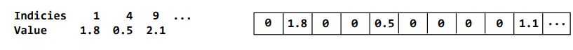
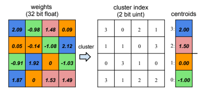
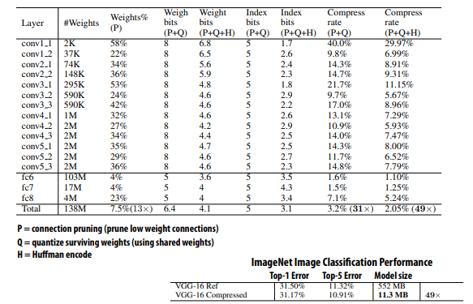
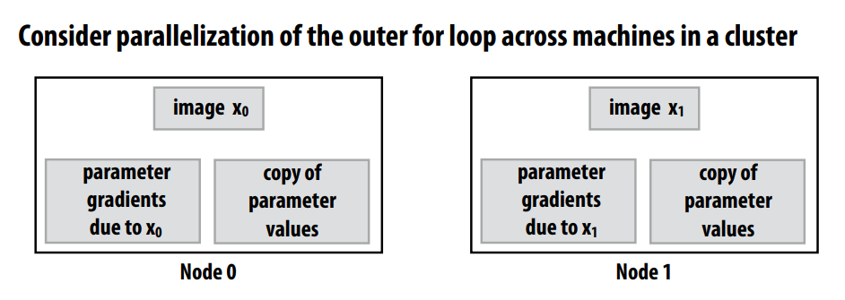
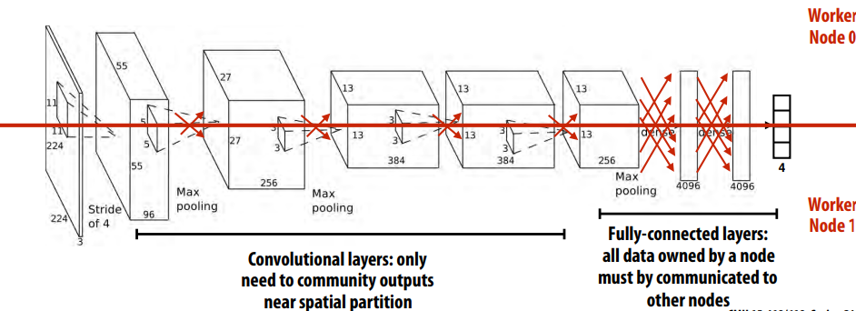
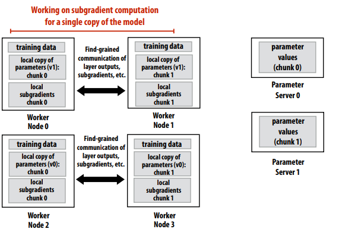

# Parallel Deep Neural Networks

Two Distinct Issues with Deep Networks
- Evaluation(or Inference): often takes milliseconds 
- Training: often takes hours, days, weeks 

## Efficiently implementing convolution layers
Direct implementation of conv layer:
``` C++
float input[INPUT_HEIGHT][INPUT_WIDTH][INPUT_DEPTH]; 
float output[INPUT_HEIGHT][INPUT_WIDTH][OUPPUT_DEPTH]; 
float layer_weights[OUPPUT_DEPTH][LAYER_CONVY][LAYER_CONVX][INPUT_DEPTH]; 
// assumes convolution stride is 1 
for (int img=0; img<IMAGE_BATCH_SIZE; img++) 
 for (int j=0; j<INPUT_HEIGHT; j++) 
  for (int i=0; i<INPUT_WIDTH; i++) 
   for (int f=0; f<OUTPUT_DEPTH; f++) { 
    output[j][i][f] = 0.f; 
     for (int kk=0; kk<INPUT_DEPTH; kk++) // sum over filter responses of input channels
      for (int jj=0; jj<LAYER_CONVY; jj++) // spatial convolution
       for (int ii=0; ii<LAYER_CONVX; ii+) // spatial convolution
            output[j][i][f] += layer_weights[f][jj][ii][kk] * input[j+jj][i+ii][kk]; 
   }
```

Here we introduce a way called __im2col__(from convolution to matrix mutiply):




This algorithm does exploit temporal locality in access to input and layer_weights

- Approach1: Algorithmic innovation: more effcient topologies
Like MobileNet:


- Approach 2:Code optimization: implement layers e!ciently
on modern hardware using many of the techniques


 
## Compress a network
You can see the paper from(Han ICLR2016):

Step 1: prune low-weight links (iteratively retrain network, then prune) 
- Over 90% of weights can be removed without signifcant loss of accuracy 
- Store weight matrices in compressed sparse row (CSR) format 


Step2: weight sharing: make surviving connects share a small set of weights 
- Cluster weights via k-means clustering (irregular (“learned”) quantization) 
- Compress weights by only storing cluster index (lg(k) bits)
- Retrain network to improve quality of cluster centroids


Step 3: Huffman encode quantized weights 
and CSR indices

VGG-16 compression result:


## Training workload
Huge computational expense 
- Must evaluate the network (forward and backward) for millions of training images 
- Must iterate for many iterations of gradient descent (100’s of thousands) 
- Training modern networks takes days 

Large memory footprint 
- Must maintain network layer outputs from forward pass 
- Additional memory to store gradients for each parameter 
- Recall parameters for popular VGG-16 network require ~500 MB of memory (training 
requires GBs of memory for academic networks) 
- Scaling to larger networks requires partitioning network across nodes to keep network + intermediates in memory 

Dependencies /synchronization (not embarrassingly parallel) 
- Each parameter update step depends on previous 
- Many units contribute to same parameter gradients (fne-scale reduction) 
- Different images in mini batch contribute to same parameter gradients

### Data-parellism

So we can see the example data-parellism training:
``` c
for each item x_i in mini-batch: 
   grad += evaluate_loss_gradient(f, loss_func, params, x_i) 
   params += -grad * step_size;
```

``` C
for each item x_i in mini-batch assigned to local node: 
 // just like single node training
 grad += evaluate_loss_gradient(f, loss_func, params, x_i) 
 barrier();
 sum reduce gradients, communicate results to all nodes 
 barrier(); 
 update copy of parameter values
```

Exploiting SGD Characteristics:Convergent computation 
- Update ordering does not matter 
- OK to have small errors in weight updates 

How used 
- Within machine: Don’t synchronize weight updates across threads 
- Between machines: 
- OK to do some computations using stale data 
- Ordering of updates not critical 
- Incomplete or redundant coverage of data set acceptable

So we can get that:
1. Cores update shared set of gradients. 
2. Skip taking locks / synchronizing across cores: perform “approximate reduction”

Parameter server design:
- Separate set of machines to 
maintain DNN parameters 
- Highly fault tolerant (so that worker 
nodes need not reliable) 
- Accept updates from workers 
asynchronously


### Model-parellism
Partition network parameters across nodes 
(spatial partitioning to reduce communication)

The typical example is in AlexNet like following graph:



So combination of model-parellism and data-parellism training like:

