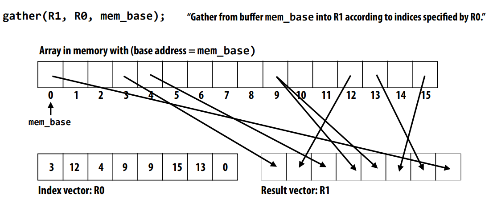

# Parellel Programming Model

## ISPC: An example
Intel SPMD Program Compiler (SPMD: single program multiple data)

SPMD programming abstraction: 
- Call to ISPC function spawns “gang” of ISPC “program instances” 
- All instances run ISPC code concurrently
Upon return, all instances have completed
SPMD(abstraction) ----(ISPC)----> SIMD(implementation)

The following picture shows the abstraction:

Here are three important ISPC keywords:
1. *programCount*: number of simultaneously 
executing instances in the gang (uniform value) 
2. *programIndex*: id of the current instance in the 
gang. (a non-uniform value: “varying”) 
3. *uniform*: A type modifer. All instances have the 
same value for this variable. Its use is purely an 
optimization. Not needed for correctness. 

Two different ways to deal with loops:
1. one looks like:


2. the other looks like:
```
export void sinx(uniform int N, uniform int terms, uniform float* x, uniform float* result){
    //assumes N	% programCount = 0
    uniform int count = N / programCount;
    int start = programIndex * count;
    for(uniform int i = 0; i < count; i++){
        int idx = i + start;
        float value	= x[idx];	
		float numer	= x[idx] * x[idx] * x[idx];	
		uniform	int	denom =	6; //	3!	
		uniform	int	sign = -1;

        for(uniform int j = 1; j < terms; i++){
            value += sign * numer / denom;
            numer *= x[idx] * x[idx];
            sign *= -1;
            denom *= (j+3)*(j+4);
        }
        result[idx] = value;
    }
}
```


The first one is better,because single “packed load” SSE instruction (_mm_load_ps1) 
efficiently implements: 
*float	value	=	x[idx];*	
for all program instances, since the four values are 
contiguous in memory

Because the iteration allocation is not very simple,There is "foreach"(key ISPC language construct) 
foreach declares parallel loop iterations 
- Programmer says: these are the iterations the 
instances in a gang cooperatively must perform
- ISPC implementation assigns iterations to program 
instances in gang 

## Other: Abstraction vs Implementation

1. Pthreads

2. ISPC


### Shared address space
abstraction:
1. Threads communicate by reading/writing to shared variables 
2. Shared variables are like a big bulletin board
3. Synchronization is important

implemention: UMA vs NUMA

### Message passing model
abstraction:
- Threads operate within their own private address spaces 
- Threads communicate by sending/receiving messages

implementation:
- Popular software library: MPI (message passing interface)

### Data-parallel model
abstraction:
- Today: often takes form of SPMD programming
- map(function,	collection)	
- Where function is applied to each element of collection independently 
- function may be a complicated sequence of logic (e.g., a loop body) 
- Synchronization is implicit at the end of the map (map returns when function has been applied to all elements of collection)

stream programing model(one to one):
- Streams: collections of elements. Elements can be processed independently 
- Kernels: side-effect-free functions. Operate element-wise on collections

using Gather/Scatter(two key data-parallel communication primitives) to build (multi to multi)
AVX2 gather instruction:



