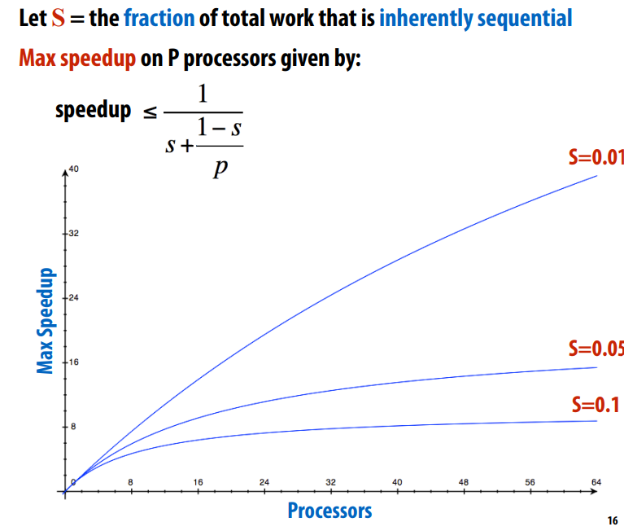
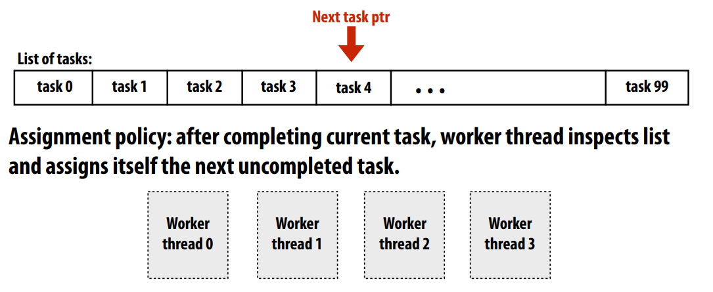

# Parellel Programming Basic

## Steps of Parellel Programming
### Decompostion
Break up problem into tasks that can be carried out in parallel
- Decomposition need not happen statically 
- New tasks can be identifed as program executes 

Main idea: create at least enough tasks to keep all execution 
units on a machine busy

From the Amdahl's law, We know that
the processor numbers and the proportion of sequential program are both key factors


### Assignment
Assigning tasks to threads
- Think of “tasks” as things to do 
- Think of threads as “workers” 

Goals: balance workload, reduce communication costs

Programmer-managed assignment vs System-manages assignment: be performed statically, or dynamically during execution. Often dynamic assignment can perform better on workload balance(like ISPC tasks queue)


### Orchestration
Involves: 
- Structuring communication 
- Adding synchronization to preserve dependencies if necessary 
- Organizing data structures in memory 
- Scheduling tasks 

Goals: reduce costs of communication/sync, preserve locality of 
data reference, reduce overhead, etc.

Tips: If synchronization or communication is expensive, might use it more sparsely

### Mapping 
Mapping “threads” (“workers”) to hardware execution units
1. Example 1: mapping by the operating system 
- e.g. map pthread to HW execution context on a CPU core 
2. Example 2: mapping by the compiler
- e.g. Map ISPC program instances to vector instruction lanes 
3. Example 3: mapping by the hardware
- e.g. Map CUDA thread blocks to GPU cores

## An Example in Slides

### Shared address space solver

synchronization and communication by barrier and lock:
``` C
// Final code
int n; // grid size	
bool done =	false;	
LOCK myLock;	
BARRIER	myBarrier;	
float diff[2];	// global diff,but now 2 copies
float *A = allocate(n+2,n+2);

void solve(float* A){
	float myDiff;//	thread local variable	
	int	index =	0;// thread	local variable	
	diff[0]	= 0.0f;	
    int	threadId = getThreadId();	
	int	myMin =	1+(threadId*n/NUM_PROCESSORS);// thread	local variable
	int	myMax =	myMin+(n/NUM_PROCESSORS)// thread	local variable	

	barrier(myBarrier,NUM_PROCESSORS);// barrier for init	
	while(!done){	
		myDiff = 0.0f;
        for(j=myMin	to myMax){	
			for	(i=red cells in	this row){	
				float prev = A[i,j];	
				A[i,j] = 0.2f*(A[i-1,j]+A[i,j-1]+A[i,j]+A[i+1,j],+A[i,j+1]);
                // accumulate into partial sum locally	
				myDiff += abs(A[i,j] - prev));	
			}	
			lock(myLock);
            // complete reduction globally at the end of the iteration	
			diff +=	myDiff;	
			unlock(myLock);
        }
        // Remove naming dependencies by using differen diff in successive loop 
        diff[(index+1)%2] =	0.0f;	
		barrier(myBarrier, NUM_PROCESSORS);	
		if (diff[index]/(n*n)<TOLERANCE)	
		    done = true;	
		index =	(index + 1)	% 2;
    }
}
```

### Message passing solver

synchronization and communication by recv and send:
1. Send and receive ghost rows to “neighbor threads”
2. Perform computation(just like in shared address space version of solver)
3. All threads send local my_diff to thread 0
4. Thread 0 computes global diff, evaluates termination predicate and sends result back to all 
other threads

Synchronous (blocking) send and receive: 
- Have high risk of deadlock
- Need right call send/recv order

Non-blocking asynchronous send/recv: 
- Use checksend(), checkrecv() to determine actual status of send/receipt 
- Calling thread can perform other work while waiting for message to be received


