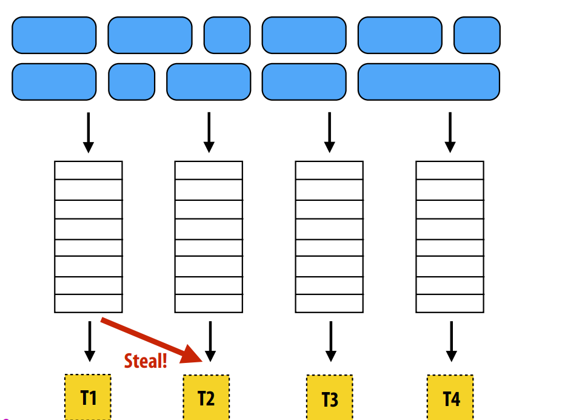
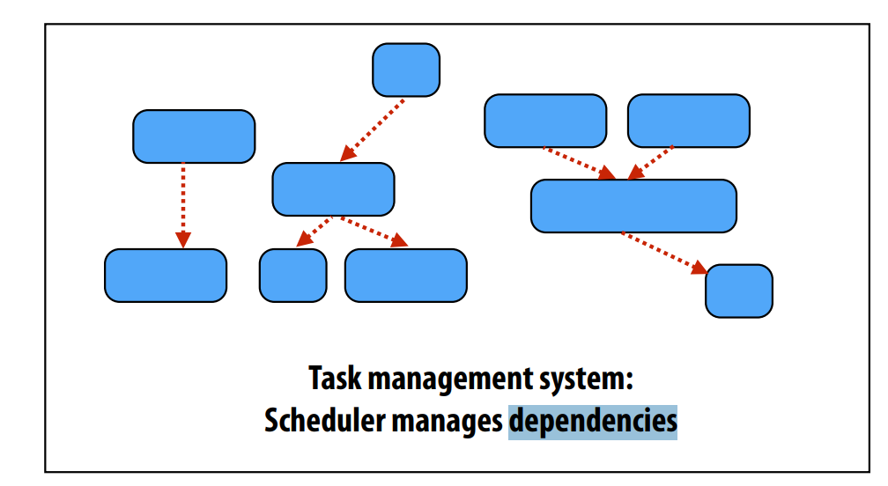

# Performance Optimization I: Work Distribution and Scheduling

Key goals (that are at odds with each other) 
- Balance workload onto available execution resources 
- Reduce communication (to avoid stalls) 
- Reduce extra work (overhead) performed to increase parallelism, manage 
assignment, reduce communication, etc.

Recall: 

Static assignment
- Good properties of static assignment: simple, essentially zero runtime overhead

“Semi-static” assignment
- Cost of work is predictable for near-term future
- Idea: recent past good predictor of near future 
- Application periodically profles itself and re-adjusts assignment
- Assignment is “static” for the interval between re-adjustments

Dynamic assignment
- Program determines assignment dynamically at runtime to ensure a well 
distributed load(The execution time of tasks, or the total number of 
tasks, is unpredictable)

Now let us talk about dynamic sheduler in the following text

## Fine granularity vs Coarse granularity
Fine granularity partitioning: 1 “task” = 1 element
``` C
// shared variable
const int N = 1024;
float* x = new float[N]; 
bool* prime = new bool[N]; 
LOCK counter_lock; 
int counter = 0;

while (1) { 
    int i; 
    lock(counter_lock); 
    i = counter++; 
    unlock(counter_lock); 
    if (i >= N) 
        break; 
    is_prime[i] = test_primality(x[i]); 
}
```
- Likely good workload balance (many small tasks) 
- Potential for high synchronization cost

Coarse granularity partitioning: 1 “task” = 10 elements
```C
// shared variable
const int N = 1024; 
const int GRANULARITY = 10;
float* x = new float[N]; 
bool* prime = new bool[N]; 
LOCK counter_lock; 
int counter = 0;

while (1) { 
    int i; 
    lock(counter_lock); 
    i = counter; 
    counter += GRANULARITY;
    unlock(counter_lock); 
    if (i >= N) 
        break; 
    int end = min(i + GRANULARITY, N); 
    for (int j=i; j<end; j++) 
        is_prime[j] = test_primality(x[j]); 
}
```
- Decreased synchronization cost
(Critical section entered 9 times less than the previous program)
- May bad workload balance

## Task Scheduler
Recall the philosophy of OS sheduler

- For smarter scheduler, we may need requires some knowledge of workload(like scheduling long tasks first), maybe can have a Predictor 
- Decreasing synchronization overhead using 
a distributed set of queues, it can avoid need for all workers to synchronize on single work queue

- A good scheduler must be able to manage the dependencies between the tasks

 
## Scheduling fork-join parallelism
- Fork-join pattern is very common in task-parallel programming(Create one thread per execution unit)
- Natural way to express independent work in divide-and-conquer algorithms

https://cilkplus.github.io/

