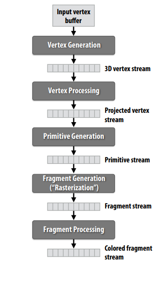
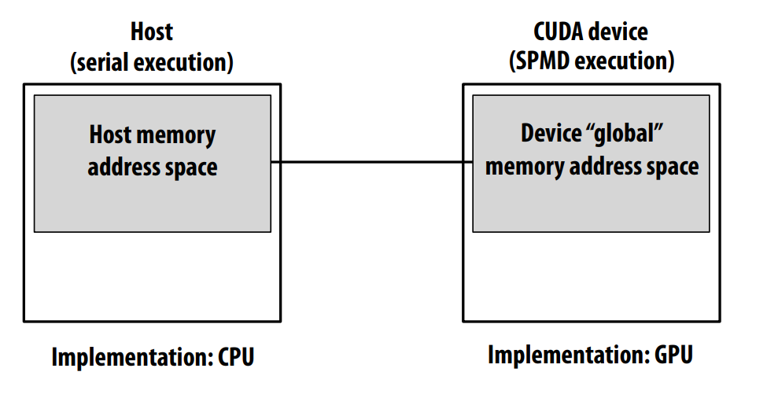
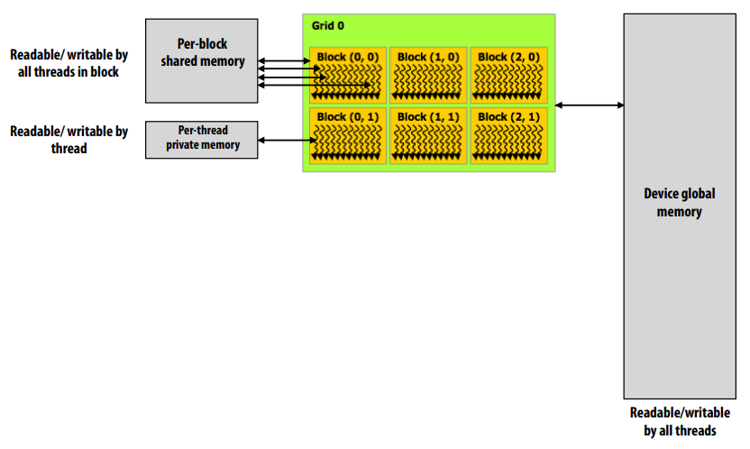
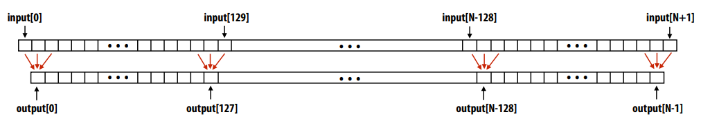
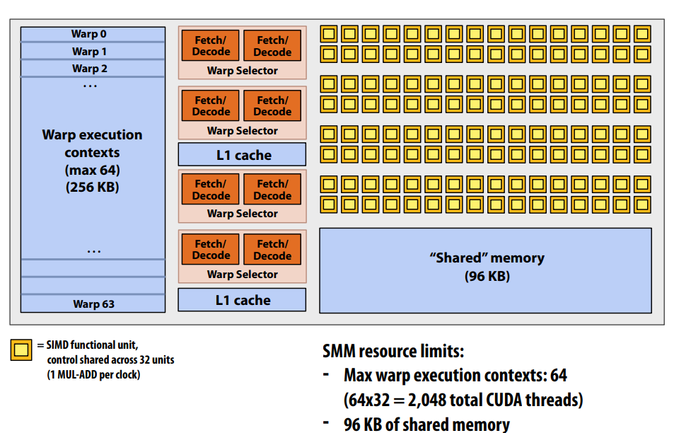
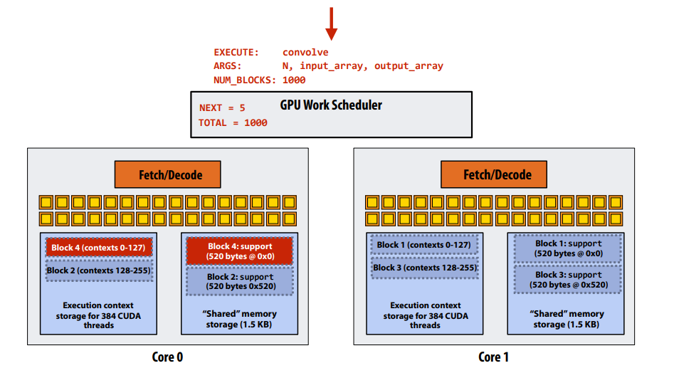

# GPU Architecture & CUDA Programming

## History of GPU
- Step 1: describe the things (the nouns)
- Step 2: describe operations the system performs on the entities (the verbs)



Graphics shading languages:
1. Allow application to extend the functionality of the 
graphics pipeline by specifying materials and lights 
programmatically! 
- Support diversity in materials 
- Support diversity in lighting conditions 
2. Programmer provides mini-programs (“shaders”) 
that define pipeline logic for certain stages
- Pipeline maps shader function onto all 
elements of input stream

Early GPUs have been just used to build the graphics pipeline, because GPUs are very fast processors for performing the same computation (shader 
programs) on large collections of data (streams of vertices, fragments, and pixels)

## GPU Computation Mode
Early GPU:
Lets say a user wants to draw a picture using a GPU… 
- Application (via graphics driver) provides GPU vertex 
and fragment shader program binaries 
- Application sets graphics pipeline parameters 
(e.g., output image size) 
- Application provides hardware a buffer of vertices 
- Go! (drawPrimitives(vertex_buffer))

Graphic computing was the only interface to GPU hardware.
GPU hardware could only execute graphics 
pipeline computations. But from NVIDIA Tesla architecture(2007), GPU first had the non-graphics-specific (“compute mode”) interface:
Lets say a user wants to run a non-graphics 
program on the GPU’s programmable cores… 
- Application can allocate buffers in GPU memory 
and copy data to/from buffers 
- Application (via graphics driver) provides GPU a 
single kernel program binary 
- Application tells GPU to run the kernel in an 
SPMD fashion (“run N instances”) 
- Go! (launch(myKernel, N))

## CUDA
CUDA programming language
- Introduced in 2007 with NVIDIA Tesla architecture 
- “C-like” language to express programs that run on GPUs using 
the compute-mode hardware interface 
- Relatively low-level: CUDA’s abstractions closely match the 
capabilities/performance characteristics of modern GPUs 
(design goal: maintain low abstraction distance) 
- Note: OpenCL is an open standards version of CUDA(Recall:OpenGL)

### Basic Example

the CUDA program often can be divided two parts:

1. “Host” code : serial execution 
Running as part of normal C/C++ 
application on CPU
```C
const int Nx = 12; 
const int Ny = 6;
dim3 threadsPerBlock(4, 3, 1); 
dim3 numBlocks(Nx/threadsPerBlock.x, 
 Ny/threadsPerBlock.y, 1); 
// assume A, B, C are allocated Nx x Ny float arrays 
// this call will trigger execution of 72 CUDA threads:
// 6 thread blocks of 12 threads each 

matrixAdd<<<numBlocks, threadsPerBlock>>>(A, B, C);
```

2. “CUDA device” code: kernel function (global
denotes a CUDA kernel function) runs on GPU
``` C
// kernel definition 
__global__ void matrixAdd(float A[Ny][Nx], float B[Ny][Nx], float C[Ny][Nx]) 
{ 
    // Each thread computes its overall grid thread id from its 
    // position in its block (threadIdx) and its block’s position in the grid (blockIdx)
    int i = blockIdx.x * blockDim.x + threadIdx.x; 
    int j = blockIdx.y * blockDim.y + threadIdx.y; 
    C[j][i] = A[j][i] + B[j][i]; 
}
```

### Memory Model

You must move data between address spaces and allocate memory explicitly
```C
float* A = new float[N]; // allocate buffer in host mem 
// populate host address space pointer A 
for (int i = 0 i < N; i++) 
    A[i] = (float)i; 
int bytes = sizeof(float) * N 
float* deviceA; // allocate buffer in device address space 
cudaMalloc(&deviceA, bytes);
// populate deviceA 
cudaMemcpy(deviceA, A, bytes, cudaMemcpyHostToDevice); 
// note: deviceA[i] is an invalid operation here (cannot 
// manipulate contents of deviceA directly from host. 
// Only from device code.)
```
Following is a typical GPU memory level model:


There are synchronization constructs in CUDA, e.g.

__syncthreads() 
- Barrier: wait for all threads in the block to arrive at this point

Atomic operations 
- e.g., float atomicAdd(float* addr, float amount)
- Atomic operations on both global memory and shared memory variables 

Host/device synchronization 
- Implicit barrier across all threads at return of kernel

## Abstraction vs Implementation
We can see the following 1 dimension convolvtion example:


```C
#define THREADS_PER_BLK 128 
__global__ void convolve(int N, float* input, float* output) { 
    __shared__ float support[THREADS_PER_BLK+2]; // per block allocation
    int index = blockIdx.x * blockDim.x + threadIdx.x; // thread local variable
    support[threadIdx.x] = input[index]; 
    if (threadIdx.x < 2) { 
        support[THREADS_PER_BLK+threadIdx.x] = input[index+THREADS_PER_BLK]; 
    } 
    __syncthreads(); 
    float result = 0.0f; // thread-local variable 
    for (int i=0; i<3; i++) 
        result += support[threadIdx.x + i]; 
    output[index] = result; 
}
```


``` C
int N = 1024 * 1024; 
cudaMalloc(&devInput, N+2); // allocate array in device memory 
cudaMalloc(&devOutput, N); // allocate array in device memory 
// property initialize contents of devInput here ... 
convolve<<<N/THREADS_PER_BLK, THREADS_PER_BLK>>>(N, devInput, devOutput);
```

Program text or Information about required resources(CUDA compiler can got): 
- 128 threads per block 
- B bytes of local data per thread 
- 130 floats (520 bytes) of shared space per thread block

So what about implementation?
This is one NVIDIA Maxwell GM204 architecture SMM unit (one “core”)


Recall, CUDA kernels execute as SPMD programs 

On NVIDIA GPUs groups of 32 CUDA threads share an instruction stream. These groups called “warps”. 

A convolve thread block is executed by 4 warps (4 warps x 32 threads/warp = 128 CUDA threads per block) 

(Warps are an important GPU implementation detail, but not a CUDA abstraction!)

SMX core operation each clock: 
- Select up to four runnable warps from 64 resident on SMM core (thread-level parallelism) 
- Select up to two runnable instructions per warp (instruction-level parallelism)

On two cores GPU, we can see the task allocation:



