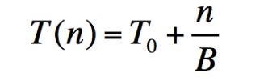
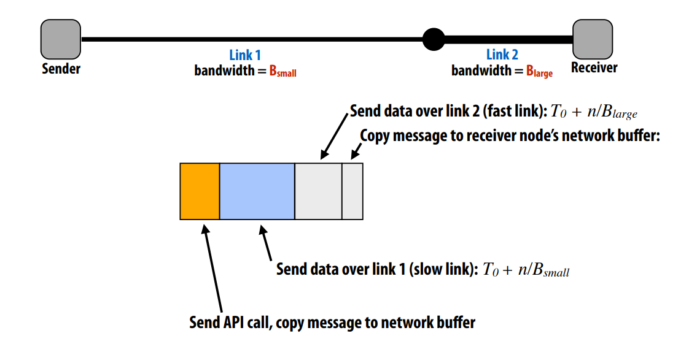
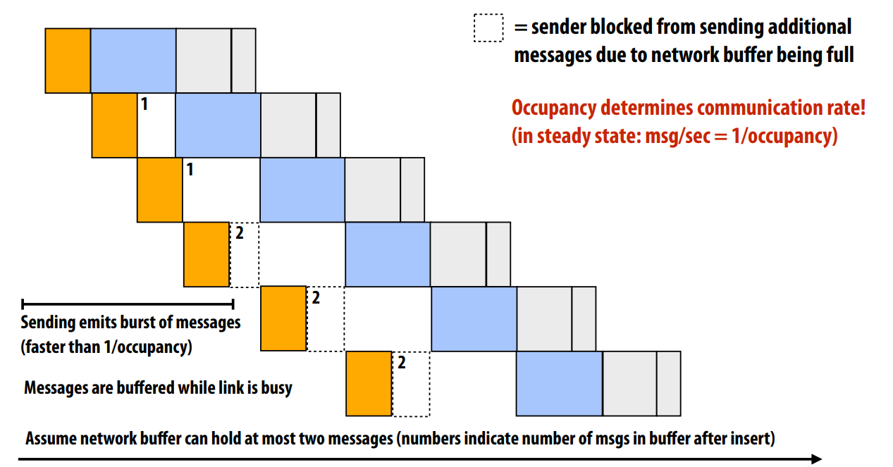
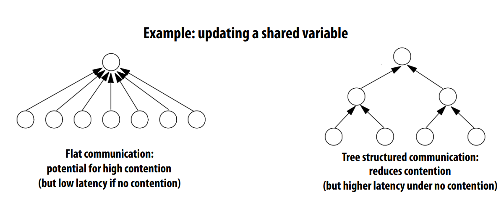

# Performance Optimization Part II: Locality, Communication, and Contention

Review: Blocking vs Non-blocking send/recv

Synchronous (blocking) send and receive(like handshake protocal)
- send(): call returns when sender receives acknowledgement that message 
data resides in address space of receiver
- recv(): call returns when data from received message is copied into address 
space of receiver and acknowledgement sent back to sender
- having the risk of deadlock

Non-blocking asynchronous send/recv
- having the risk of overflow of allocated buffers
- send(): call returns immediately, recv(): posts intent to receive in the future, returns immediately
- Buffer provided to send() cannot be modifed by calling thread since message processing 
occurs concurrently with thread execution
- Calling thread can perform other work while waiting for message to be sent 
- Use checksend(), checkrecv() to determine actual status of send/receipt
- Calling thread can perform other work while waiting for message to be received

Review:Latency vs Throughput

Latency
- The amount of time needed for an operation to complete. 
- A memory load that misses the cache has a latency of 200 cycles
- A packet takes 20 ms to be sent from my computer to Google

Bandwidth
- The rate at which operations are performed. 
- Memory can provide data to the processor at 25 GB/sec. 
- A communication link can send 10 million messages per second

## Model of Communication

### non-pipelined communication

sending a n-bit message:

- T(n) = transfer time (overall latency of the operation) 
- T0 = start-up latency (e.g., time until frst bit arrives at destination) 
- n = bytestransferred in operation
- B = transfer rate (__bandwidth__ of the link)
- "Effective bandwidth" = n / T(n) 

### more general communication
Total communication time = overhead + occupancy + network delay

- Orange part:overhead (time spent on the communication by a processor)
- Blue part:occupancy (time for data to pass through slowest component of system)
- Grey part:network delay (everything else)

So it can be pipelined like the following picture:

## Cost vs Time
- Total communication time = overhead + occupancy + network delay
- Total communication cost = communication time - overlap
- Overlap: portion of communication performed concurrently with other work
- Overlap is very useful to deal with high cost 

e.g. Asynchronous message send/recv allows communication to be overlapped with computation

e.g.  Pipelining allows multiple message sends to be overlapped

So we can think of “communication” more generally: 
- Communication between a processor and its cache 
- Communication between processor and memory (e.g., memory on same machine) 
- Communication between processor and a remote memory 
(e.g., memory on another node in the cluster, accessed by sending a network message)

In this extended memory hierarchy, higher level(close to proc) means lower latency, higher bandwidth and smaller capacity; and lower level(remote from proc) means higher latency, lower bandwidth and larger capacity. That is why managing locality is important at all levels

## Reason for Communication

- Inherent  communication: communication that must occur in a parallel algorithm- the communication 
is fundamental to the algorithm.
- Artifactual communication: all other communication (artifactual 
communication results from practical details of system 
implementation)

Four different misses:
- Cold miss: First time data touched. Unavoidable in a sequential program.
- Capacity miss: Working set is larger than cache. Can be avoided/reduced by increasing cache size.
- Confict miss: Miss induced by cache management policy. Can be avoided/reduced 
by changing cache associativity, or data access pattern in application.
- Communication miss (new): Due to inherent or artifactual communication in parallel system

## Techniques for reducing communication

1. Changing date access order
2. Improving temporal locality by fusing loops
3. Improve arithmetic intensity by sharing data
4. Exploiting spatial locality

We also need to deal with contention: Contention occurs when many requests to a resource are made within a 
small window of time (the resource is a “hot spot”)

We can see trade-off in different type of communication model:

