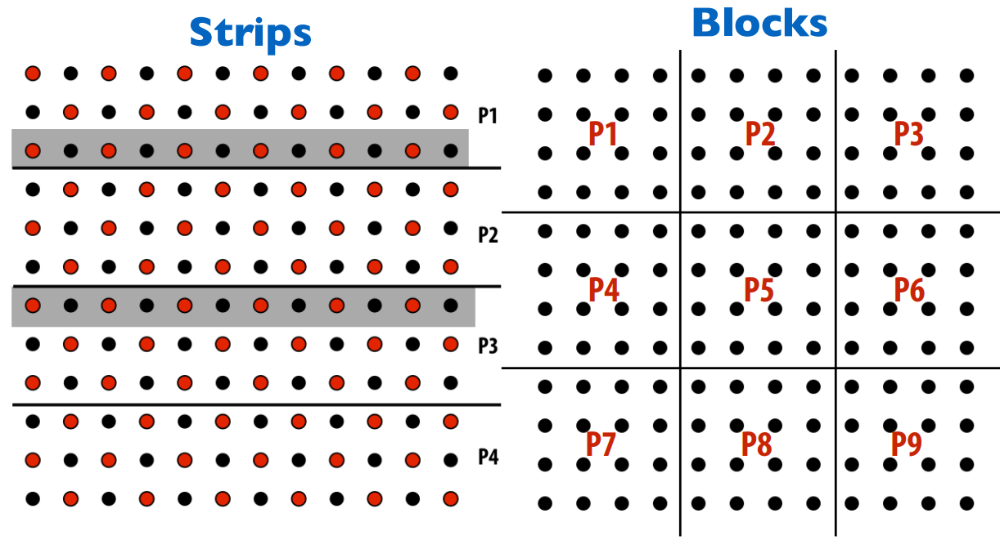
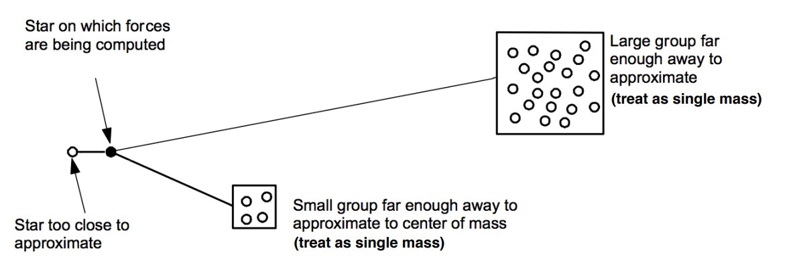

# Parallel Programming Case Studies

We must think about the example applications in the context of a large NUMA 
shared address space machine.

## Case 1: Simulation of Ocean Currents 
Let us recall this typical example:

### Two Static Partitioning Schemes


The first one's arithmetic intensity is
smaller than the second that means less operation per memory move.

### Two layouts of 2D grid in address space


The second layout is more efficient for avoiding the caches capicity miss.

## Case2: Galaxy Evolution using Barnes Hut
Barnes-Hut algorithm to compute the gravity of each star:



- Leaf nodes are star particles 
- Interior nodes store center of mass + aggregate mass of all child bodies 
- To compute forces on each body, traverse tree... accumulating forces from all other bodies 
- Compute forces using aggregate interior node if L/D < ϴ, else descend to children 
- Expected number of nodes touched ~ lg N / ϴ2

``` 
for	each time step in simulation:	
	build tree structure	
	compute(aggregate mass,	center-of-mass)for interior	nodes	
		for	each particle:	
			traverse tree to accumulate	gravitational forces update	position
```
Barnes-Hut application challenges: 
- Amount of work per body is non-uniform, communication pattern is non-uniform(depends on the local density of bodies) 
- The bodies move: so costs and communication patterns change over time
- Irregular, fne-grained computation 
- But, there is a lot of locality in the computation (bodies that are near in space 
require similar data to compute forces — it seems smart to co-locate these 
computations!)

Costzones, takes advantage of the fact that the Barnes-Hut algorithm already has a representation of the spatial distribution of bodies encoded in its tree data
structure. Thus, we can partition this existing data structure itself and obtain the goal of partitioning space. Here is a high-level description. Every internal cell stores the total cost associated with all the bodies it contains. The total work or cost in the system is divided among processes so that every process has a contiguous, equal range or zone of work (for example, a total work of 1000 units would be split among 10 processes so that zone 1-100 units isassigned to the first process, zone 101-200 to the second, and so on). Which cost zone a body in the tree belongs to can be determined by the total cost of an inorder traversal of the tree up to that body. Processes traverse the tree in parallel, picking up the bodies that belong in their cost zone


